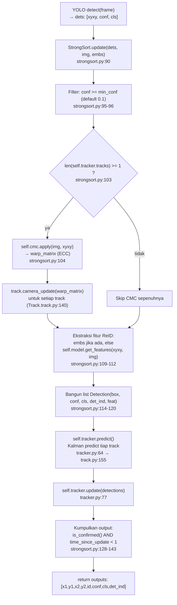
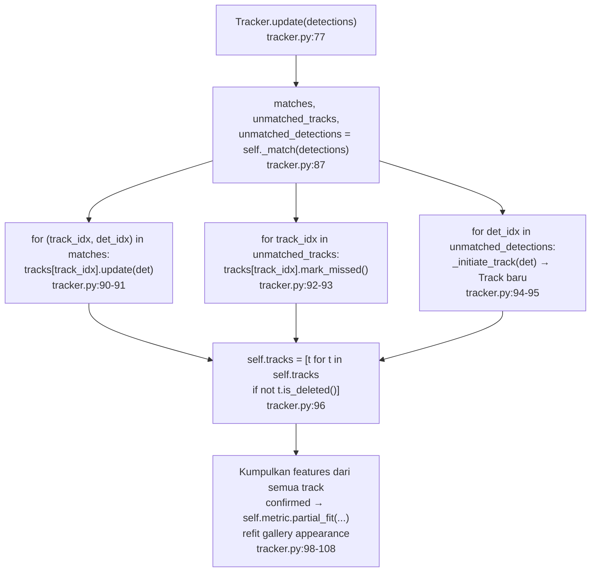
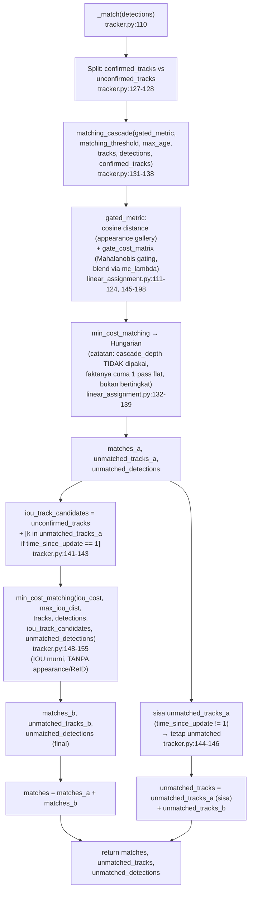
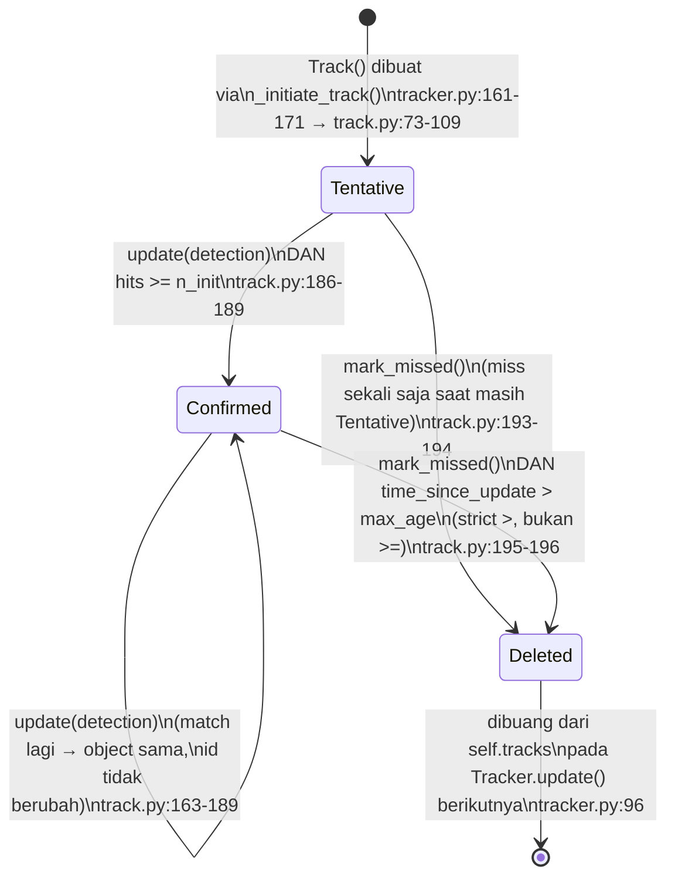

# StrongSORT — Flowchart Alur Eksekusi & Lifecycle Track

Dokumen ini merangkum alur pemanggilan method dan pembuatan object di pipeline
`strongsort_custom`, dari output YOLO mentah sampai output track per frame,
termasuk lifecycle state sebuah `Track`. Semua referensi baris kode mengacu ke
file di `strongsort_custom/`. Diagram dalam format Mermaid — render otomatis
di GitHub/GitLab, VS Code (ekstensi Markdown Preview Mermaid), atau editor
Markdown modern lainnya.

---

## 1. Alur per-frame (level tinggi)

Dari deteksi YOLO mentah sampai output track StrongSORT untuk satu frame.

**Poin kunci:**
- CMC di-skip total kalau belum ada track sama sekali (frame pertama) — tidak
  masalah, karena track baru selalu dibuat langsung dari koordinat deteksi
  frame saat ini (lihat §4).
- Ekstraksi fitur ReID terjadi **per deteksi**, bukan per track — sekali per
  frame untuk semua deteksi yang lolos filter `min_conf`.
- Output hanya menampilkan track yang **confirmed DAN baru saja ter-update**
  di frame ini — track yang sedang miss tetap hidup di `self.tracker.tracks`
  tapi tidak muncul di output.

---

## 2. Detail `Tracker.update(detections)`

**Poin kunci:** `self.tracks` adalah **list yang sama** yang terus dimutasi
(bukan dibuat ulang) — objek `Track` yang miss lalu match lagi tetap objek
Python yang sama, sehingga `id`-nya tidak pernah berubah.

---

## 3. Detail `Tracker._match(detections)` — Matching Cascade + IOU fallback

**Poin kunci (rawan ditanya saat sidang):**
- `matching_cascade()` menerima `cascade_depth` tapi **tidak pernah
  memakainya** untuk membagi track per level usia — implementasinya cuma
  **satu kali** `min_cost_matching` flat atas seluruh `confirmed_tracks`
  sekaligus, bukan cascade bertingkat seperti di paper DeepSORT/StrongSORT
  aslinya.
- Konsekuensinya: track dengan `time_since_update` besar (covariance Kalman
  sudah melebar) bisa "merebut" deteksi yang seharusnya lebih cocok untuk
  track yang baru saja miss sekali (`time_since_update=1`), karena keduanya
  diperlakukan setara dalam satu assignment global — potensi sumber ID switch.
- IOU fallback (`iou_track_candidates`) hanya diberikan ke: (a) track yang
  **belum confirmed**, dan (b) track confirmed yang **baru saja miss sekali**
  — bukan semua unmatched track. Ini murni geometris, tidak melibatkan
  ReID/appearance sama sekali.

---

## 4. Lifecycle `Track` (state machine)

**Poin kunci:**
- Track `Tentative` **tidak punya toleransi miss sama sekali** — sekali saja
  gagal match sebelum lolos `n_init`, langsung `Deleted`.
- Track `Confirmed` boleh miss berkali-kali sampai `time_since_update >
  max_age` (contoh: `max_age=30` → track masih hidup sampai miss ke-30, baru
  mati di miss ke-31).
- Hanya track `Confirmed` dengan `time_since_update == 0` (baru update di
  frame ini) yang dikeluarkan sebagai output (`strongsort.py:129`).
- Quirk khusus CI (`track.py:91-99`): jika env var `GITHUB_ACTIONS=true` dan
  bukan job `mot-metrics-benchmark`, track lahir langsung `Confirmed` (skip
  `Tentative`) — murni untuk lolos test CI, tidak relevan di lingkungan
  eksperimen normal.

---

## 5. Peta pembuatan object — siapa membuat apa, kapan, dan seberapa sering

| Object | Dibuat di mana | Frekuensi | Catatan |
|---|---|---|---|
| `StrongSort` | Caller (pipeline evaluasi/inference) | **Sekali** per run/video | Memegang `self.model` (ReID), `self.tracker`, `self.cmc` |
| `ReID` (`self.model`) | `StrongSort.__init__` (strongsort.py:71-73) | **Sekali** per run | Model dipakai ulang tiap frame lewat `get_features()` |
| `Tracker` (`self.tracker`) | `StrongSort.__init__` (strongsort.py:76-83) | **Sekali** per run | Menyimpan `self.tracks: List[Track]` yang hidup sepanjang video |
| CMC/`ECC` — `StrongSort.cmc` | `StrongSort.__init__` (strongsort.py:86) | **Sekali** per run | **Aktif dipakai** di `update()` tiap frame |
| CMC/`ECC` — `Tracker.cmc` | `Tracker.__init__` (tracker.py:62) | **Sekali** per run | **Dead code** — dibuat tapi tidak pernah dipanggil di `tracker.py` manapun |
| `NearestNeighborDistanceMetric` | `StrongSort.__init__` (strongsort.py:77, di-pass ke `Tracker`) | **Sekali** per run | Menyimpan gallery fitur (`self.samples`) tiap target id, di-*refit* tiap frame via `partial_fit` |
| `Detection` | `StrongSort.update()` (strongsort.py:115-120) | **Per deteksi, per frame** (setelah filter `min_conf`) | Objek sekali pakai — dikonsumsi lalu dibuang tiap frame |
| `Track` | `Tracker._initiate_track()` (tracker.py:161-171) | **Per deteksi yang unmatched** (track baru) | Hidup lintas-frame sampai `is_deleted()`; menyimpan `self.kf` (Kalman filter) miliknya sendiri |
| `KalmanFilterXYAH` (`track.kf`) | `Track.__init__` (track.py:108) | **Satu per `Track`** | Setiap track punya instance Kalman filter sendiri — tidak dibagi antar track |

---

## Ringkasan alur satu frame (versi teks singkat)

1. YOLO → `dets` (xyxy, conf, cls) → filter `conf >= min_conf`.
2. Jika ada track existing → CMC (`ECC`) hitung `warp_matrix` → geser `mean`
   tiap track (`camera_update`).
3. Ekstrak fitur ReID per deteksi → bungkus jadi `Detection` objects.
4. `Tracker.predict()` — Kalman predict tiap track (covariance melebar).
5. `Tracker.update(detections)`:
   a. `_match()`: matching cascade (appearance + gating, flat bukan
      bertingkat) atas confirmed tracks → sisa + unconfirmed tracks masuk
      IOU fallback (khusus `time_since_update == 1` atau belum confirmed).
   b. Track matched → `.update()` (Kalman correction + EMA appearance).
   c. Track unmatched → `.mark_missed()` (bisa jadi `Deleted`).
   d. Deteksi unmatched → `Track` baru (`Tentative`).
   e. Buang track `Deleted` dari list.
   f. Refit gallery appearance (`partial_fit`) dengan fitur semua track
      confirmed.
6. Output: track `Confirmed` dengan `time_since_update == 0` saja.
